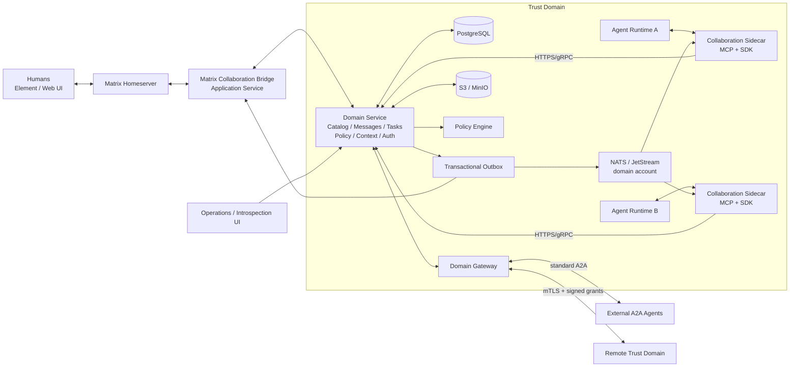
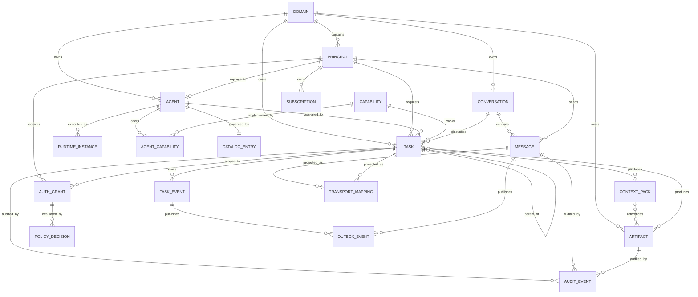
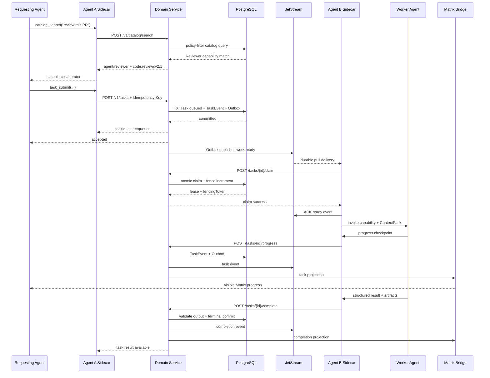
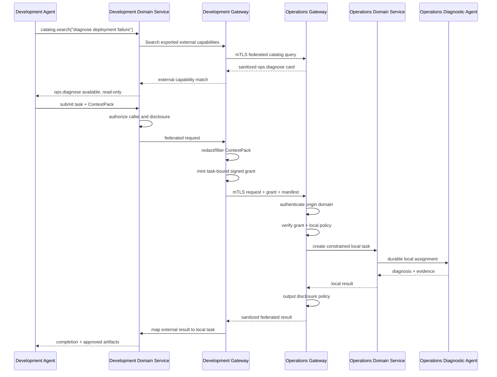
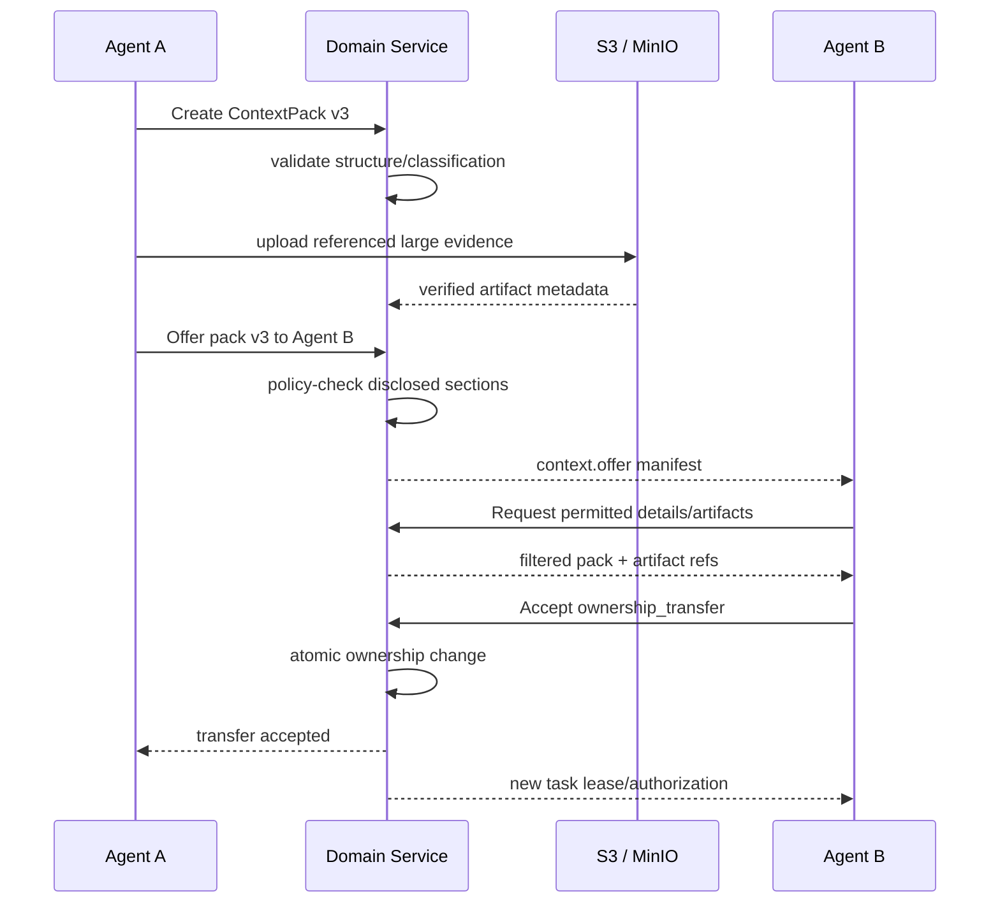
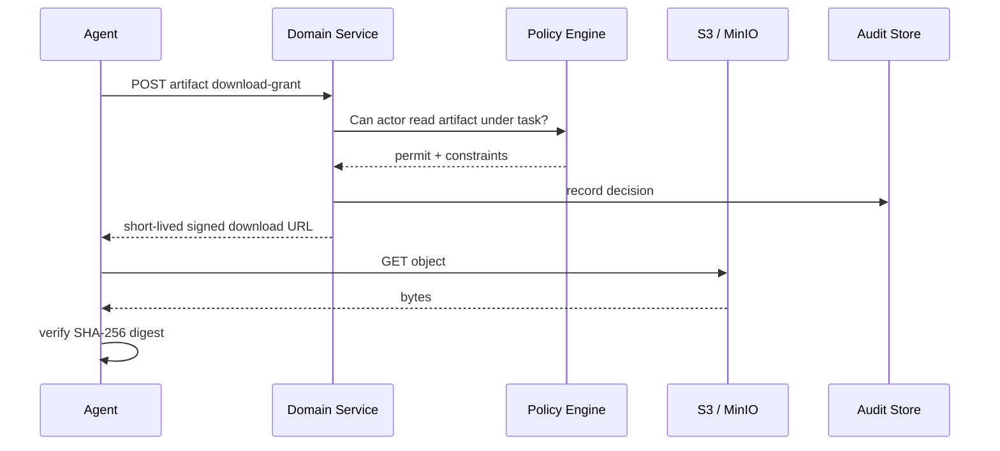

# Agent Collaboration Platform: Implementable Product and Technical Specification

## Executive summary

The recommended target is a **hybrid collaboration fabric** in which **Matrix is the human-visible collaboration plane, NATS/JetStream is the durable machine-delivery plane, PostgreSQL is the canonical control/state plane, S3/MinIO is the artifact plane, A2A is the external interoperability boundary, and MCP is the agent-facing integration surface**.

The important architectural conclusion is that none of Matrix, NATS, A2A, MCP, Hermes, or HIVE should individually be “the platform”:

| Component | Role in the proposed platform |
|---|---|
| **PostgreSQL domain service** | Canonical tasks, messages, catalog, policy decisions, ContextPacks, subscriptions, audit indexes, transactional outbox |
| **Matrix** | Human-readable rooms, DMs, threads, history, participation, approvals UX, collaboration timeline |
| **NATS + JetStream** | Outbound-only agent connectivity, durable wake-up/delivery, worker dispatch, pub/sub, ephemeral streams |
| **S3 / MinIO** | Immutable artifacts, large context sections, files, logs, patches, generated outputs |
| **MCP** | Simple typed tool/resource interface presented to LLM runtimes |
| **A2A** | Standards-compatible gateway for agents outside the platform |
| **HIVE ideas** | Simple agent ergonomics, inboxes, identity, monitoring, poll/push semantics, optional sealed-secret exchange |
| **Hermes ideas** | Matrix-native collaboration UX, thread/session isolation, media, visible tool activity, loop prevention |

This deliberately avoids the weaknesses of the obvious pure architectures.

A **Matrix-only** architecture gives excellent inspectability but makes you invent work queues, leases, retries, worker balancing, task fencing, and canonical execution semantics. A **NATS-only** architecture gives excellent machine communications but makes you build most of the useful human collaboration interface. A **pure A2A mesh** requires network-reachable serving endpoints or gateways and does not provide rooms, shared mailboxes, or general brokered pub/sub. A **pure MCP design** provides an excellent invocation interface but not an offline agent communication fabric.

Matrix explicitly supports custom events, rooms, synchronization and extensibility; its Application Service API can reserve agent user namespaces and act on behalf of virtual users. Crucially, an Application Service cannot prevent or modify an event sent to Matrix, so it must **not** be the execution authorization boundary. citeturn18view1turn18view2turn18view3

Hermes is strong evidence that Matrix works well as an agent-facing collaboration environment: its Matrix adapter supports rooms, DMs, threads, files/media, mention gating and optional E2EE, and its session model deliberately separates thread/room/user context. fileciteturn0file0L2-L8 fileciteturn0file3L89-L95

NATS contributes a different primitive. NATS accounts create genuinely isolated subject spaces: two accounts on the same server do not see each other's traffic unless explicit sharing is configured. JetStream pull consumers add durable worker delivery with explicit acknowledgement, which maps naturally to outbound-only agent containers. citeturn19view0turn15view0

A2A contributes the best semantics for external agent interoperability: Agent Cards, skills, catalog-oriented discovery, messages versus stateful tasks, artifacts, context IDs, polling, streaming and webhooks. The A2A documentation explicitly describes curated registries that can search by skills/tags while leaving the registry API itself unspecified, which is almost exactly the opening needed for the platform catalog proposed here. citeturn12view0turn12view1turn19view3

MCP belongs at the *other* boundary: the current MCP specification exposes typed tools through `tools/list`/`tools/call`, resources through `resources/list`/`resources/read`, and authorization-aware tool/resource visibility. That makes it well suited to turning the platform into a small set of tools an arbitrary LLM runtime can use without giving the model Matrix, NATS, database or object-store credentials. citeturn13view4turn13view5turn13view6

### Recommended topology



The **canonical-state rule** is central:

> An accepted operation is durable when its PostgreSQL transaction commits. Matrix and NATS are projections/delivery mechanisms, not independent sources of truth.

A task write and an outbox record therefore commit atomically. If NATS or Matrix is unavailable, the task still exists and the outbox catches the transport up when it recovers. Conversely, an arbitrary Matrix message or NATS publish does not become authorized executable work merely because an agent received it.

### Open-ended operating assumptions

These are starting values for design and testing, **not product limits**.

| Dimension | Provisional default |
|---|---:|
| Registered logical agents | 10–500 initially; design should not preclude 5,000+ |
| Concurrent agent runtimes | 20–200 initially |
| Persistent messages/events | ≤100/s steady, ≤1,000/s short burst |
| Task submissions | ≤20/s steady |
| Ephemeral stream chunks | ≤5,000/s aggregate |
| Inline structured payload | 32 KiB application limit |
| Single artifact | 1 GiB default, configurable |
| Artifact storage/domain | 10 TiB default quota, configurable |
| Message/task retention | 90 days default |
| JetStream replay window | 7–30 days depending on stream |
| Audit metadata retention | 365 days or organization policy |
| Deployment | One region, multi-AZ initially |
| Connectivity | Agents require outbound HTTPS and NATS only; no inbound port |
| Human IAM | Existing OIDC-compatible identity provider assumed |
| Infrastructure | Kubernetes, HA PostgreSQL, S3/MinIO as stipulated |
| Availability target | Provisional 99.9% control plane |
| Backup objective | Provisional RPO ≤5 min, RTO ≤60 min |

The proposed 32 KiB inline limit is deliberately lower than Matrix's federation-event ceiling: complete federated Matrix events are constrained to 65,536 bytes, so large ContextPacks and artifacts should be referenced rather than embedded. citeturn10view2


## Design synthesis and technology choices

The research points to a useful separation between **conversation, execution, transport, interoperability and model integration**.

Matrix supplies persistent shared conversational spaces. Hermes demonstrates how those spaces can be turned into useful agent sessions, including isolated thread contexts, visible activity and media. A central Matrix Application Service can reserve an exclusive namespace such as `@_agent_.*`, and Matrix explicitly allows it to act as users in that namespace, meaning hundreds of logical agents can appear as distinct participants without each application storing an ordinary Matrix access token. citeturn18view1turn18view3

One Hermes design decision is particularly worth keeping: automated status traffic should not become new conversational work. Hermes ignores `m.notice` by default among other loop protections, while Matrix itself specifies `m.notice` for automated informational messages and states that automated clients must not automatically respond to notices. That is an excellent protocol-level convention for preventing agent status ping-pong. citeturn10view3

HIVE contributes excellent ergonomics but should not remain the durability substrate. In the supplied HIVE-Light source, an agent has a persistent logical identity, DMs have delivery/read semantics, monitoring can inspect tenant-wide messages, and the implementation offers REST/MCP/WebSocket/polling paths. At the same time, the core `Message.content` is a string and JSONL persistence is explicitly described as best-effort, making a richer typed protocol plus proper canonical storage desirable. See the [inspected HIVE-Light source evidence](sandbox:/mnt/data/hive-light-source-evidence.txt).

A2A supplies a strong abstraction boundary between organizations. Its Agent Card contains identity, endpoint, protocol capabilities, authentication requirements and skills; its documentation explicitly permits registry-based discovery and selective disclosure. Its task model distinguishes lightweight messages from trackable work, keeps terminal tasks immutable, associates related tasks/messages through `contextId`, and makes artifacts the intended carrier for outputs. citeturn12view0turn12view1turn13view3

A2A should **not**, however, become the internal fleet topology. Its standard bindings are JSON-RPC, gRPC and HTTP+JSON, and asynchronous updates are polling, streams, or HTTP webhooks. A webhook receiver has to be HTTP-reachable. That is excellent at a gateway, but unnecessary friction for short-lived containers that should only establish outbound connections. citeturn13view1turn19view3

NATS/JetStream solves precisely that internal transport issue. The platform should exploit JetStream pull consumers for worker/inbox durability but keep business state in PostgreSQL. NATS accounts also provide a valuable *structural* model for trust domains: account boundaries isolate subject spaces rather than relying entirely on increasingly complicated topic ACLs. citeturn19view0turn15view0

MQTT remains a credible alternative broker. MQTT 5 is explicitly a lightweight client/server publish-subscribe protocol, has QoS 0/1/2, persistent session mechanisms, shared subscriptions, response topics and correlation data. It is especially compelling in constrained/IoT environments. For this platform, however, those advantages do not compensate for having to build agent/task semantics and replay-oriented workflow facilities already covered more naturally by JetStream and the domain service. Note also that MQTT QoS 2's protocol-level “exactly once” must not be confused with exactly-once execution of arbitrary business side effects. citeturn17view0

### What to borrow

| Source | Keep | Do not inherit blindly |
|---|---|---|
| **Matrix** | Rooms, membership, threads, history, identities, reactions, custom events, optional federation/E2EE | Do not make room events canonical task state |
| **Hermes** | Room/thread session boundaries, visible progress, mention gating, media handling, notice/loop suppression | Do not infer execution permission merely from a Matrix user/room allowlist |
| **HIVE** | Simple agent API, persistent identity, DMs/channels, inbox semantics, polling/push, monitoring, sealed-secret concept | Replace string-only payloads and local/best-effort persistence |
| **NATS/JetStream** | Outbound connections, durable wake-ups, worker pools, subscriptions, account isolation, transient streams | Do not let arbitrary subject publication bypass policy/task state |
| **A2A** | Agent Cards, skills, task semantics, context association, artifacts, streaming/polling, external auth model | Do not require every internal agent to expose an A2A server |
| **MCP** | Typed agent tools/resources and runtime-independent integration | Do not treat MCP as an offline message queue |
| **S3/MinIO** | Large immutable payloads, lifecycle/versioning infrastructure | Do not embed permanent object credentials in messages |

### Protocol trade-offs

The following ratings are architectural judgments based on the protocol capabilities described by the relevant specifications. Matrix supports rooms and extensible room events; NATS provides subjects, request/reply and JetStream consumers; MQTT provides brokered pub/sub plus three QoS levels; A2A provides agent-oriented request/task semantics over service endpoints. citeturn18view2turn15view0turn17view0turn12view1turn13view1

| Dimension | Matrix | NATS + JetStream | MQTT 5 | A2A |
|---|---|---|---|---|
| Outbound-only agent containers | **Excellent** | **Excellent** | **Excellent** | **Poor–moderate** without gateway |
| Agent-to-agent conversational rooms | **Native** | Application layer | Application layer | Contexts, but not rooms |
| Human participation | **Excellent** | Custom UI required | Custom UI required | Custom UI required |
| Human-readable history | **Native** | Custom projection/UI | Custom storage/UI | Task/message APIs |
| Direct RPC | Custom | **Native request/reply** | Response-topic pattern | **Core protocol purpose** |
| Pub/sub / fan-out | Room events | **Excellent** | **Excellent** | Not general-purpose |
| Durable offline delivery | Room history/sync | **Excellent with JetStream** | Sessions/QoS | Agent implementation |
| Replay / consumers | Conversation history | **Excellent** | More limited abstraction | Poll/list task |
| Work queues | Custom | **Excellent** | Shared-subscription pattern | Task service, not broker queue |
| Structured payloads | Custom events | Arbitrary bytes/JSON | Arbitrary bytes | **Native Parts/data** |
| Tasks and lifecycle | Custom | Custom | Custom | **Native** |
| Files/artifacts | Matrix media | Object Store or external | External/custom | **Native artifact concepts** |
| Capability discovery | Custom | Custom | Custom | **Agent Cards/skills** |
| Built-in human client ecosystem | **Strongest** | None | None | None |
| Fine trust segmentation | Rooms/homeservers | **Accounts + subjects** | Broker ACLs/topics | Server authorization |
| E2EE conversation support | **Native option** | Payload-level/custom | Payload-level/custom | Transport/app-specific |
| Machine throughput | Moderate | **Excellent** | **Excellent** | RPC-oriented |
| Infrastructure weight | Medium–high | Low–medium | Low | Low per service, gateway needed |
| Best role here | Collaboration plane | Machine delivery plane | Not selected | External interop plane |

A2A authentication is intentionally based on standard web security rather than putting client identity in the protocol payload; its Agent Cards advertise authentication and its server is responsible for authorization. That maps well onto the proposed gateway, where external identity is translated into a tightly scoped internal principal. citeturn13view0turn13view2


## Product requirements and behavior

The product SHALL expose one coherent collaboration abstraction regardless of whether a particular interaction is later projected through Matrix, NATS or A2A.

**Goals**

The platform MUST let an agent discover another agent by capability; exchange conversational and structured information; create durable trackable tasks; transfer structured working context; publish/fetch artifacts; collaborate while offline; stream non-critical live progress; introspect what agents explicitly communicate and execute; and cooperate across controlled trust boundaries without granting broad mutual access.

The system MUST support logical agents whose containers have **no inbound service endpoint**.

It MUST be agent-framework-neutral. A Python worker, Claude/Hermes-like runtime, custom Go process, or another future agent framework should be able to participate through SDK, REST/gRPC or MCP.

**Non-goals**

The platform SHALL NOT be the agent's private LLM memory system, orchestration framework, hidden reasoning store, vector database or tool runtime. Auditability covers explicit messages, task transitions, context handoffs, policy decisions and tool/execution telemetry—not hidden chain-of-thought.

It SHALL NOT promise exactly-once execution of arbitrary external side effects. It instead provides at-least-once delivery where appropriate, idempotent task transitions, fencing, deduplication and explicit reconciliation for non-idempotent actions.

Matrix SHALL NOT be treated as the authoritative task queue. NATS SHALL NOT be treated as the authoritative task database. An external A2A request SHALL NOT bypass local authorization.

### Normative functional requirements

| ID | Requirement |
|---|---|
| **CAT-01** | Agents MAY self-register an AgentCard; newly self-registered catalog entries default to `draft` unless policy auto-approves them. |
| **CAT-02** | `catalog.search` MUST support natural-language query, capability IDs, tags, structured input/output compatibility, side-effect limits, data classifications, domain/trust filters and availability. |
| **CAT-03** | Policy filtering MUST happen **before** search results are returned so hidden capabilities are not leaked. |
| **CAT-04** | Search ranking MAY use lexical/vector relevance, but hard capability/schema/policy constraints take precedence. |
| **CAT-05** | An entry MUST distinguish a persistent logical agent from ephemeral runtime instances. |
| **CAT-06** | External A2A Agent Cards MAY be imported and normalized into the catalog. |
| **ID-01** | Logical agent identity MUST remain stable across container restarts. |
| **ID-02** | Every active process MUST have a distinct `runtimeInstanceId`. |
| **ID-03** | Sender identity MUST be derived from authenticated credentials, never trusted from user/model-supplied JSON. |
| **ID-04** | Human Matrix/OIDC identities MUST map explicitly to internal principals. Matrix display names are not identities. |
| **DOM-01** | Every principal, task, artifact, conversation and catalog entry MUST belong to a trust domain. |
| **DOM-02** | Cross-domain access defaults to deny. A domain explicitly exports capabilities another domain may discover/invoke. |
| **DOM-03** | Cross-domain execution MUST traverse policy-enforcing gateways unless an administrator explicitly provisions another trust relationship. |
| **DOM-04** | Gateways MUST independently evaluate outgoing disclosure and incoming execution. |
| **MSG-01** | All persistent communication MUST use a typed `MessageEnvelope`; plain chat is one message type, not the entire protocol. |
| **MSG-02** | Every message MUST carry explicit trigger semantics. Status/notice traffic MUST default to non-triggering. |
| **MSG-03** | Conversations and task threads MUST have stable IDs independent of transport-specific Matrix/NATS identifiers. |
| **MSG-04** | Duplicate `messageId` or idempotency keys MUST not create duplicate canonical messages. |
| **TASK-01** | Task creation MUST atomically persist the Task and an outbox event before returning success. |
| **TASK-02** | Task claims MUST use leases, optimistic revision checks and monotonically increasing fencing tokens. |
| **TASK-03** | Task completion MUST validate output against the selected Capability's output schema. |
| **TASK-04** | Terminal task states are immutable. Refinements create child/follow-up tasks. This intentionally follows A2A's terminal-task model. |
| **TASK-05** | A crashed worker's retryable task MUST become claimable after lease expiry. |
| **TASK-06** | Irreversible operations MUST NOT be automatically retried merely because a lease expired; they enter reconciliation unless their action contract proves idempotency. |
| **TASK-07** | Cancellation is a request followed by acknowledgement; a cancellation race may legitimately resolve to completed/failed rather than canceled. |
| **CTX-01** | Context transfer MUST use a typed ContextPack instead of implicitly copying an agent's entire transcript. |
| **CTX-02** | ContextPack MUST distinguish established facts, hypotheses, decisions, open questions and requested continuation. |
| **CTX-03** | Large evidence MUST be represented by references; ContextPack should remain a compact manifest. |
| **CTX-04** | Ownership transfer MUST require receiver acceptance before canonical task ownership changes. |
| **CTX-05** | Imported context is data/evidence, not privileged instructions. Authorization is never inherited from text inside a ContextPack. |
| **ART-01** | Artifacts MUST be immutable/versioned objects with digest, media type, classification and provenance. |
| **ART-02** | Agents MUST access artifacts through short-lived authorization, not permanent S3 credentials. |
| **ART-03** | Required uploads MUST complete integrity verification before a task can successfully reference them as final output. |
| **STR-01** | Token/tool-progress streams MAY use ephemeral Core NATS; meaningful checkpoints and final results MUST be durable. |
| **STR-02** | Stream consumers MUST be able to recover current task state after missing ephemeral chunks. |
| **DEL-01** | Offline logical agents MUST receive durable directed messages/tasks after reconnect. |
| **DEL-02** | Delivery is at least once at transport boundaries; state transitions are deduplicated and revision-guarded. |
| **SUB-01** | Agents MAY subscribe to explicit event topics, capability queues, conversations and task updates. |
| **SUB-02** | An event subscription MUST explicitly state whether matching events are allowed to wake/invoke an agent. |
| **POL-01** | Policy checks MUST cover catalog visibility, message routing, capability invocation, task claim, delegation, ContextPack sections and artifact access. |
| **POL-02** | Capability side-effect class (`none/read/write/irreversible`) MUST be an authorization input. |
| **POL-03** | High-risk actions MAY require structured human approval tied to action hash + task revision + expiry. |
| **AUD-01** | Every privileged state mutation MUST emit an immutable audit record containing authenticated actor, target, decision, outcome and trace ID. |
| **AUD-02** | The UI MUST distinguish “agent said it did X” from a platform/tool execution record proving X was requested/executed. |
| **AUD-03** | Auditable message plaintext versus metadata-only audit MUST be a domain policy choice. |
| **TEL-01** | Message/task causation and distributed trace IDs MUST survive every transport projection. |
| **TEL-02** | Metrics MUST expose queue age, outbox lag, consumer lag, task duration, retries, lease expiry, policy denials and projection lag. |
| **BAK-01** | PostgreSQL, S3 and Matrix state/keys MUST have documented restore procedures and recurring restore tests. |
| **BAK-02** | JetStream MUST be recoverable without losing canonical accepted work; canonical state and outbox/event history therefore reside outside JetStream. |

A2A's existing distinction between immediate messages and stateful tasks, plus its terminal-task immutability rule, directly motivates `TASK-04`; A2A also explicitly warns that transient streaming messages should not be treated as reliable delivery for critical information, which supports keeping critical state in the domain service rather than a live stream. citeturn12view1turn19view3

### Task lifecycle

```text
submitted
    │
    ├──────────────► rejected [terminal]
    │
    ▼
  queued
    │
    ├──────────────► canceled [terminal]
    │
    ├──────────────► expired  [terminal]
    │
    ▼
  claimed
    │
    ├── lease expires ───────► queued     (retry-safe only)
    │
    ▼
  running
    │
    ├──────────────► input_required ─────► running
    │
    ├──────────────► blocked ────────────► running
    │
    ├──────────────► cancel_requested ───► canceled
    │                       │
    │                       ├────────────► succeeded
    │                       └────────────► failed
    │
    ├──────────────► succeeded [terminal]
    └──────────────► failed    [terminal]
```

| State | Meaning |
|---|---|
| `submitted` | Canonically committed; target/routing decision is being finalized |
| `queued` | Authorized and eligible to be claimed |
| `claimed` | Runtime holds a lease but has not necessarily begun model/tool execution |
| `running` | Work is actively executing |
| `input_required` | Assignee needs further information/authorization |
| `blocked` | Waiting on a known dependency |
| `cancel_requested` | Cooperative cancellation requested |
| `succeeded` | Validated result committed |
| `failed` | Terminal unsuccessful result |
| `rejected` | Request was valid enough to identify but not accepted |
| `canceled` | Cancellation acknowledged |
| `expired` | Deadline/retention policy ended the task before completion |

Every state-changing request carries `expectedRevision`. Claims additionally receive a `fencingToken`. A stale worker holding fence `17` cannot write after another worker has reclaimed the task under fence `18`.

### Message and event taxonomy

| Type | Durable by default | May wake agent by default | Purpose |
|---|---:|---:|---|
| `chat.message` | Yes | Only when directed/subscribed | Human/agent conversation |
| `chat.notice` | Yes | **Never** | Status/readable projection |
| `event.notification` | Yes | Only explicit subscription | Facts such as PR updated |
| `task.request` | Yes | Through task queue | Structured work request projection |
| `task.status` | Yes | No | Progress/state update |
| `task.input` | Yes | Yes, for referenced task | Additional requested information |
| `task.result` | Yes | No | Structured result projection |
| `context.offer` | Yes | Yes | Offer a handoff/context package |
| `context.accepted` | Yes | No | Handoff acknowledgement |
| `artifact.published` | Yes | No | Artifact availability |
| `approval.request` | Yes | Human workflow | Structured approval |
| `approval.decision` | Yes | Task resumes if valid | Approval result |
| `catalog.changed` | Yes | No | Registry invalidation |
| `policy.denied` | Yes/audit | No | Policy-denial notification |
| `stream.chunk` | No | No | Live transient text/tool progress |
| `presence.changed` | Usually no | No | Availability signal |

The `chat.notice` rule deliberately mirrors Matrix's `m.notice` semantics so one agent's “working…” output does not recursively awaken another agent. citeturn10view3

### ContextPack behavior

A ContextPack is not a memory dump. It is an immutable, versioned *handover manifest*. A receiver should initially get the manifest and compact summaries; it can subsequently request authorized sections and artifacts.

The required conceptual divisions are:

| Section | Meaning |
|---|---|
| Objective | What the work is trying to accomplish |
| Acceptance criteria | Objective definition of “done” |
| Current state | Completed and remaining work |
| Facts | Assertions treated as established, each with provenance/confidence |
| Hypotheses | Unverified explanations explicitly kept separate from facts |
| Decisions | Choices already made and their rationale |
| Open questions | Remaining unknowns |
| Workspace | Repository/commit/branch/environment/reproduction state |
| Evidence | Conversation/tool/evidence references |
| Artifacts | Large immutable inputs/results |
| Requested continuation | Consultation, subtask or ownership transfer |
| Execution constraints | Time, side-effect, budget and approval limits |
| Security | Classification, permitted domains, redactions |
| Provenance | Who assembled the handoff and from which work |

A2A's `contextId` remains useful at an interoperability boundary, but it is an association identifier rather than a portable representation of an agent's complete working state; A2A explicitly describes it as grouping related Tasks and Messages. The richer ContextPack is therefore an application-level concept. citeturn12view1turn19view3


## Canonical data model and contracts

The service should be implemented as a **modular monolith first**: one stateless Domain Service deployment with PostgreSQL modules for catalog, messages, tasks, context, authorization and audit. There is no architectural reason to begin with six separately deployed microservices.

### Sources of truth

| Information | Canonical store | Secondary projection |
|---|---|---|
| Agent/catalog definitions | PostgreSQL | Search index/cache |
| Agent runtime availability | PostgreSQL snapshot + ephemeral signal | NATS presence |
| Typed messages | PostgreSQL | Matrix + JetStream |
| Conversations | PostgreSQL metadata | Matrix room/thread |
| Tasks/state | PostgreSQL | JetStream + Matrix notices |
| Task events | PostgreSQL append-only event table | JetStream + Matrix |
| ContextPack manifests | PostgreSQL | Matrix reference |
| Large ContextPack sections | S3/MinIO | None |
| Artifacts | S3/MinIO + PostgreSQL metadata | Matrix attachment/reference if desired |
| Authorization grants | PostgreSQL/KMS-backed signer | Short-lived signed tokens |
| Policy decisions | PostgreSQL audit | Observability stream |
| Human-readable collaboration history | PostgreSQL canonical envelope + Matrix timeline | — |
| Ephemeral stream chunks | None | Core NATS |
| Transport offsets | PostgreSQL / JetStream consumer state | — |

NATS Object Store could technically carry chunked files and metadata, but given the assumed S3/MinIO infrastructure, using S3 as the canonical artifact store avoids coupling large-object durability to the messaging system. NATS Object Store remains a viable lightweight deployment option. citeturn8view0

### Relational model

At minimum, PostgreSQL contains:

`domains`, `principals`, `agents`, `runtime_instances`, `capabilities`, `agent_capabilities`, `catalog_entries`, `conversations`, `messages`, `tasks`, `task_events`, `context_packs`, `artifacts`, `auth_grants`, `policy_decisions`, `subscriptions`, `audit_events`, `outbox_events`, `transport_mappings`, and `idempotency_keys`.

Every tenant-owned row has `domain_id`. Important uniqueness constraints include `messages.message_id`, `(domain_id,idempotency_key)` where applicable, `(task_id,event_sequence)`, `(agent_id,capability_id,capability_version)`, and transport mappings such as `(transport,external_id)`.



### Normative JSON Schema bundle

The platform uses JSON Schema Draft 2020-12. The following document is the canonical v1 contract bundle. `$defs/AgentCard` is **the platform's normalized internal card**, not a claim that it is byte-for-byte an A2A Agent Card; the A2A gateway maps between them.

```json
{
  "$schema": "https://json-schema.org/draft/2020-12/schema",
  "$id": "urn:acollab:schema:v1",
  "title": "Agent Collaboration Platform Contracts",
  "$defs": {
    "ActorRef": {
      "type": "object",
      "additionalProperties": false,
      "required": ["kind", "id", "domainId"],
      "properties": {
        "kind": {
          "enum": ["agent", "human", "service", "domain"]
        },
        "id": {
          "type": "string",
          "minLength": 1,
          "maxLength": 256
        },
        "domainId": {
          "type": "string",
          "minLength": 1,
          "maxLength": 128
        },
        "displayName": {
          "type": "string",
          "maxLength": 256
        }
      }
    },
    "Capability": {
      "type": "object",
      "additionalProperties": false,
      "required": [
        "id",
        "version",
        "name",
        "description",
        "inputSchema",
        "outputSchema",
        "sideEffects"
      ],
      "properties": {
        "id": {
          "type": "string",
          "pattern": "^[a-z0-9][a-z0-9._-]{1,127}$"
        },
        "version": {
          "type": "string",
          "minLength": 1,
          "maxLength": 64
        },
        "name": {
          "type": "string",
          "minLength": 1,
          "maxLength": 128
        },
        "description": {
          "type": "string",
          "minLength": 1,
          "maxLength": 4096
        },
        "tags": {
          "type": "array",
          "items": {
            "type": "string",
            "maxLength": 64
          },
          "uniqueItems": true
        },
        "inputSchema": {
          "type": "object"
        },
        "outputSchema": {
          "type": "object"
        },
        "inputMediaTypes": {
          "type": "array",
          "items": {
            "type": "string"
          }
        },
        "outputMediaTypes": {
          "type": "array",
          "items": {
            "type": "string"
          }
        },
        "sideEffects": {
          "enum": ["none", "read", "write", "irreversible"]
        },
        "dataClasses": {
          "type": "array",
          "items": {
            "type": "string"
          },
          "uniqueItems": true
        },
        "requiredPermissions": {
          "type": "array",
          "items": {
            "type": "string"
          },
          "uniqueItems": true
        },
        "examples": {
          "type": "array",
          "maxItems": 10,
          "items": {
            "type": "object"
          }
        },
        "timeoutSeconds": {
          "type": "integer",
          "minimum": 1
        },
        "costHint": {
          "type": "object",
          "additionalProperties": true
        }
      }
    },
    "AgentCard": {
      "type": "object",
      "additionalProperties": false,
      "required": [
        "schemaVersion",
        "agentId",
        "domainId",
        "displayName",
        "description",
        "owner",
        "capabilities",
        "interfaces"
      ],
      "properties": {
        "schemaVersion": {
          "const": "1.0"
        },
        "agentId": {
          "type": "string",
          "pattern": "^[a-zA-Z0-9][a-zA-Z0-9._:/-]{1,255}$"
        },
        "domainId": {
          "type": "string",
          "minLength": 1,
          "maxLength": 128
        },
        "displayName": {
          "type": "string",
          "minLength": 1,
          "maxLength": 256
        },
        "description": {
          "type": "string",
          "minLength": 1,
          "maxLength": 4096
        },
        "owner": {
          "type": "object",
          "additionalProperties": false,
          "required": ["team"],
          "properties": {
            "team": {
              "type": "string"
            },
            "contact": {
              "type": "string"
            },
            "service": {
              "type": "string"
            }
          }
        },
        "status": {
          "enum": ["active", "degraded", "offline", "disabled"],
          "default": "active"
        },
        "capabilities": {
          "type": "array",
          "items": {
            "$ref": "#/$defs/Capability"
          }
        },
        "interfaces": {
          "type": "array",
          "items": {
            "type": "object",
            "additionalProperties": false,
            "required": ["protocol"],
            "properties": {
              "protocol": {
                "enum": ["acollab", "a2a", "mcp"]
              },
              "binding": {
                "type": "string"
              },
              "url": {
                "type": "string",
                "format": "uri"
              },
              "version": {
                "type": "string"
              },
              "tenant": {
                "type": "string"
              }
            }
          }
        },
        "authSchemes": {
          "type": "array",
          "items": {
            "type": "string"
          },
          "uniqueItems": true
        },
        "labels": {
          "type": "object",
          "additionalProperties": {
            "type": "string"
          }
        },
        "cardVersion": {
          "type": "integer",
          "minimum": 1
        },
        "updatedAt": {
          "type": "string",
          "format": "date-time"
        }
      }
    },
    "CatalogEntry": {
      "type": "object",
      "additionalProperties": false,
      "required": [
        "entryId",
        "agentCard",
        "visibility",
        "approval",
        "availability",
        "source"
      ],
      "properties": {
        "entryId": {
          "type": "string",
          "minLength": 1,
          "maxLength": 256
        },
        "agentCard": {
          "$ref": "#/$defs/AgentCard"
        },
        "visibility": {
          "enum": ["private", "domain", "exported", "public"]
        },
        "exportedCapabilities": {
          "type": "array",
          "items": {
            "type": "string"
          },
          "uniqueItems": true
        },
        "trustTier": {
          "enum": ["local", "partner", "external", "untrusted"]
        },
        "approval": {
          "type": "object",
          "additionalProperties": false,
          "required": ["status"],
          "properties": {
            "status": {
              "enum": ["draft", "approved", "suspended", "revoked"]
            },
            "approvedBy": {
              "type": "string"
            },
            "approvedAt": {
              "type": "string",
              "format": "date-time"
            },
            "policyVersion": {
              "type": "string"
            }
          }
        },
        "availability": {
          "type": "object",
          "additionalProperties": false,
          "required": ["state"],
          "properties": {
            "state": {
              "enum": [
                "available",
                "busy",
                "queueable",
                "offline",
                "unknown"
              ]
            },
            "activeInstances": {
              "type": "integer",
              "minimum": 0
            },
            "queueDepth": {
              "type": "integer",
              "minimum": 0
            },
            "observedAt": {
              "type": "string",
              "format": "date-time"
            }
          }
        },
        "source": {
          "type": "object",
          "additionalProperties": false,
          "required": ["type"],
          "properties": {
            "type": {
              "enum": ["native", "a2a", "hive", "manual"]
            },
            "uri": {
              "type": "string"
            },
            "digest": {
              "type": "string"
            }
          }
        },
        "searchText": {
          "type": "string",
          "maxLength": 8192
        },
        "labels": {
          "type": "object",
          "additionalProperties": {
            "type": "string"
          }
        }
      }
    },
    "ArtifactRef": {
      "type": "object",
      "additionalProperties": false,
      "required": [
        "artifactId",
        "version",
        "uri",
        "mediaType",
        "sizeBytes",
        "digest",
        "classification",
        "createdBy",
        "createdAt"
      ],
      "properties": {
        "artifactId": {
          "type": "string",
          "minLength": 1,
          "maxLength": 256
        },
        "version": {
          "type": "integer",
          "minimum": 1
        },
        "uri": {
          "type": "string",
          "pattern": "^artifact://"
        },
        "filename": {
          "type": "string",
          "maxLength": 512
        },
        "mediaType": {
          "type": "string",
          "minLength": 1,
          "maxLength": 256
        },
        "sizeBytes": {
          "type": "integer",
          "minimum": 0
        },
        "digest": {
          "type": "object",
          "additionalProperties": false,
          "required": ["algorithm", "value"],
          "properties": {
            "algorithm": {
              "const": "sha-256"
            },
            "value": {
              "type": "string",
              "pattern": "^[A-Fa-f0-9]{64}$"
            }
          }
        },
        "classification": {
          "type": "string",
          "minLength": 1,
          "maxLength": 128
        },
        "createdBy": {
          "$ref": "#/$defs/ActorRef"
        },
        "createdAt": {
          "type": "string",
          "format": "date-time"
        },
        "expiresAt": {
          "type": ["string", "null"],
          "format": "date-time"
        },
        "sourceTaskId": {
          "type": "string"
        },
        "provenance": {
          "type": "object",
          "additionalProperties": true
        },
        "encryption": {
          "type": "object",
          "additionalProperties": true
        }
      }
    },
    "MessageEnvelope": {
      "type": "object",
      "additionalProperties": false,
      "required": [
        "schemaVersion",
        "messageId",
        "type",
        "sender",
        "recipients",
        "domainId",
        "createdAt",
        "content",
        "triggerMode"
      ],
      "properties": {
        "schemaVersion": {
          "const": "1.0"
        },
        "messageId": {
          "type": "string",
          "minLength": 1,
          "maxLength": 256
        },
        "type": {
          "enum": [
            "chat.message",
            "chat.notice",
            "event.notification",
            "task.request",
            "task.status",
            "task.input",
            "task.result",
            "context.offer",
            "context.accepted",
            "artifact.published",
            "approval.request",
            "approval.decision",
            "catalog.changed",
            "policy.denied",
            "stream.chunk",
            "presence.changed"
          ]
        },
        "sender": {
          "$ref": "#/$defs/ActorRef"
        },
        "recipients": {
          "type": "array",
          "minItems": 1,
          "items": {
            "$ref": "#/$defs/ActorRef"
          }
        },
        "domainId": {
          "type": "string",
          "minLength": 1,
          "maxLength": 128
        },
        "conversationId": {
          "type": "string"
        },
        "taskId": {
          "type": "string"
        },
        "correlationId": {
          "type": "string"
        },
        "causationId": {
          "type": "string"
        },
        "replyTo": {
          "type": "string"
        },
        "createdAt": {
          "type": "string",
          "format": "date-time"
        },
        "expiresAt": {
          "type": ["string", "null"],
          "format": "date-time"
        },
        "priority": {
          "enum": ["low", "normal", "high", "critical"],
          "default": "normal"
        },
        "triggerMode": {
          "enum": ["never", "directed", "subscription", "task-state"]
        },
        "content": {
          "type": "object",
          "additionalProperties": false,
          "required": ["mediaType", "data"],
          "properties": {
            "mediaType": {
              "type": "string"
            },
            "data": {}
          }
        },
        "artifacts": {
          "type": "array",
          "items": {
            "$ref": "#/$defs/ArtifactRef"
          }
        },
        "contextRefs": {
          "type": "array",
          "items": {
            "type": "object",
            "additionalProperties": false,
            "required": ["contextPackId", "version"],
            "properties": {
              "contextPackId": {
                "type": "string"
              },
              "version": {
                "type": "integer",
                "minimum": 1
              },
              "sections": {
                "type": "array",
                "items": {
                  "type": "string"
                }
              }
            }
          }
        },
        "authorizationTokenId": {
          "type": "string"
        },
        "labels": {
          "type": "object",
          "additionalProperties": {
            "type": "string"
          }
        },
        "traceparent": {
          "type": "string"
        },
        "idempotencyKey": {
          "type": "string",
          "maxLength": 256
        }
      }
    },
    "Task": {
      "type": "object",
      "additionalProperties": false,
      "required": [
        "taskId",
        "domainId",
        "capability",
        "requester",
        "state",
        "revision",
        "createdAt",
        "updatedAt",
        "input",
        "attempt"
      ],
      "properties": {
        "taskId": {
          "type": "string",
          "minLength": 1,
          "maxLength": 256
        },
        "domainId": {
          "type": "string",
          "minLength": 1,
          "maxLength": 128
        },
        "conversationId": {
          "type": "string"
        },
        "parentTaskId": {
          "type": ["string", "null"]
        },
        "capability": {
          "type": "object",
          "additionalProperties": false,
          "required": ["id", "version"],
          "properties": {
            "id": {
              "type": "string"
            },
            "version": {
              "type": "string"
            }
          }
        },
        "requester": {
          "$ref": "#/$defs/ActorRef"
        },
        "targetAgentId": {
          "type": ["string", "null"]
        },
        "assignee": {
          "oneOf": [
            {
              "$ref": "#/$defs/ActorRef"
            },
            {
              "type": "null"
            }
          ]
        },
        "state": {
          "enum": [
            "submitted",
            "queued",
            "claimed",
            "running",
            "input_required",
            "blocked",
            "cancel_requested",
            "succeeded",
            "failed",
            "rejected",
            "canceled",
            "expired"
          ]
        },
        "revision": {
          "type": "integer",
          "minimum": 1
        },
        "attempt": {
          "type": "integer",
          "minimum": 1
        },
        "input": {
          "type": "object"
        },
        "contextRefs": {
          "type": "array",
          "items": {
            "type": "object",
            "required": ["contextPackId", "version"],
            "properties": {
              "contextPackId": {
                "type": "string"
              },
              "version": {
                "type": "integer",
                "minimum": 1
              }
            }
          }
        },
        "lease": {
          "oneOf": [
            {
              "type": "null"
            },
            {
              "type": "object",
              "additionalProperties": false,
              "required": [
                "leaseId",
                "runtimeInstanceId",
                "fencingToken",
                "expiresAt"
              ],
              "properties": {
                "leaseId": {
                  "type": "string"
                },
                "runtimeInstanceId": {
                  "type": "string"
                },
                "fencingToken": {
                  "type": "integer",
                  "minimum": 1
                },
                "expiresAt": {
                  "type": "string",
                  "format": "date-time"
                }
              }
            }
          ]
        },
        "authorizationTokenId": {
          "type": "string"
        },
        "policyDecisionId": {
          "type": "string"
        },
        "result": {
          "type": ["object", "null"]
        },
        "resultArtifacts": {
          "type": "array",
          "items": {
            "$ref": "#/$defs/ArtifactRef"
          }
        },
        "failure": {
          "oneOf": [
            {
              "type": "null"
            },
            {
              "type": "object",
              "additionalProperties": false,
              "required": ["code", "message", "retryable"],
              "properties": {
                "code": {
                  "type": "string"
                },
                "message": {
                  "type": "string"
                },
                "retryable": {
                  "type": "boolean"
                },
                "details": {
                  "type": "object"
                }
              }
            }
          ]
        },
        "createdAt": {
          "type": "string",
          "format": "date-time"
        },
        "updatedAt": {
          "type": "string",
          "format": "date-time"
        },
        "deadlineAt": {
          "type": ["string", "null"],
          "format": "date-time"
        },
        "completedAt": {
          "type": ["string", "null"],
          "format": "date-time"
        },
        "idempotencyKey": {
          "type": "string",
          "maxLength": 256
        }
      }
    },
    "ContextPack": {
      "type": "object",
      "additionalProperties": false,
      "required": [
        "schemaVersion",
        "contextPackId",
        "version",
        "objective",
        "currentState",
        "requestedContinuation",
        "security",
        "provenance",
        "createdAt"
      ],
      "properties": {
        "schemaVersion": {
          "const": "1.0"
        },
        "contextPackId": {
          "type": "string",
          "minLength": 1,
          "maxLength": 256
        },
        "version": {
          "type": "integer",
          "minimum": 1
        },
        "base": {
          "oneOf": [
            {
              "type": "null"
            },
            {
              "type": "object",
              "required": ["contextPackId", "version"],
              "properties": {
                "contextPackId": {
                  "type": "string"
                },
                "version": {
                  "type": "integer",
                  "minimum": 1
                }
              }
            }
          ]
        },
        "objective": {
          "type": "string",
          "minLength": 1,
          "maxLength": 8192
        },
        "acceptanceCriteria": {
          "type": "array",
          "items": {
            "type": "string",
            "maxLength": 2048
          }
        },
        "currentState": {
          "type": "object",
          "additionalProperties": false,
          "required": ["summary", "completed", "remaining"],
          "properties": {
            "summary": {
              "type": "string",
              "maxLength": 16384
            },
            "completed": {
              "type": "array",
              "items": {
                "type": "string",
                "maxLength": 4096
              }
            },
            "remaining": {
              "type": "array",
              "items": {
                "type": "string",
                "maxLength": 4096
              }
            }
          }
        },
        "facts": {
          "type": "array",
          "items": {
            "type": "object",
            "additionalProperties": false,
            "required": ["statement", "confidence", "assertedBy"],
            "properties": {
              "statement": {
                "type": "string",
                "maxLength": 8192
              },
              "confidence": {
                "type": "number",
                "minimum": 0,
                "maximum": 1
              },
              "assertedBy": {
                "$ref": "#/$defs/ActorRef"
              },
              "evidenceRefs": {
                "type": "array",
                "items": {
                  "type": "string"
                }
              },
              "observedAt": {
                "type": "string",
                "format": "date-time"
              }
            }
          }
        },
        "hypotheses": {
          "type": "array",
          "items": {
            "type": "object",
            "additionalProperties": false,
            "required": ["statement", "confidence"],
            "properties": {
              "statement": {
                "type": "string",
                "maxLength": 8192
              },
              "confidence": {
                "type": "number",
                "minimum": 0,
                "maximum": 1
              },
              "evidenceRefs": {
                "type": "array",
                "items": {
                  "type": "string"
                }
              }
            }
          }
        },
        "decisions": {
          "type": "array",
          "items": {
            "type": "object",
            "additionalProperties": false,
            "required": ["decision", "rationale"],
            "properties": {
              "decision": {
                "type": "string",
                "maxLength": 8192
              },
              "rationale": {
                "type": "string",
                "maxLength": 8192
              },
              "madeBy": {
                "$ref": "#/$defs/ActorRef"
              },
              "at": {
                "type": "string",
                "format": "date-time"
              }
            }
          }
        },
        "openQuestions": {
          "type": "array",
          "items": {
            "type": "string",
            "maxLength": 4096
          }
        },
        "workspace": {
          "type": "array",
          "items": {
            "type": "object",
            "additionalProperties": true
          }
        },
        "conversationRefs": {
          "type": "array",
          "items": {
            "type": "object",
            "additionalProperties": false,
            "required": ["conversationId"],
            "properties": {
              "conversationId": {
                "type": "string"
              },
              "fromMessageId": {
                "type": "string"
              },
              "toMessageId": {
                "type": "string"
              }
            }
          }
        },
        "toolResultRefs": {
          "type": "array",
          "items": {
            "type": "string"
          }
        },
        "artifacts": {
          "type": "array",
          "items": {
            "$ref": "#/$defs/ArtifactRef"
          }
        },
        "requestedContinuation": {
          "type": "object",
          "additionalProperties": false,
          "required": ["mode", "instruction"],
          "properties": {
            "mode": {
              "enum": [
                "subtask",
                "ownership_transfer",
                "consultation"
              ]
            },
            "instruction": {
              "type": "string",
              "minLength": 1,
              "maxLength": 16384
            },
            "expectedOutputCapability": {
              "type": "string"
            }
          }
        },
        "executionConstraints": {
          "type": "object",
          "additionalProperties": true
        },
        "security": {
          "type": "object",
          "additionalProperties": false,
          "required": ["classification", "allowedDomains"],
          "properties": {
            "classification": {
              "type": "string"
            },
            "allowedDomains": {
              "type": "array",
              "items": {
                "type": "string"
              },
              "uniqueItems": true
            },
            "redactionsApplied": {
              "type": "array",
              "items": {
                "type": "string"
              }
            },
            "instructionsTrusted": {
              "const": false
            }
          }
        },
        "provenance": {
          "type": "object",
          "additionalProperties": false,
          "required": ["createdBy"],
          "properties": {
            "createdBy": {
              "$ref": "#/$defs/ActorRef"
            },
            "sourceTaskId": {
              "type": "string"
            },
            "sourceAgentId": {
              "type": "string"
            }
          }
        },
        "createdAt": {
          "type": "string",
          "format": "date-time"
        },
        "digest": {
          "type": "string",
          "pattern": "^[A-Fa-f0-9]{64}$"
        }
      }
    },
    "AuthorizationToken": {
      "type": "object",
      "additionalProperties": false,
      "required": [
        "jti",
        "issuer",
        "subject",
        "audience",
        "domainId",
        "actions",
        "issuedAt",
        "notBefore",
        "expiresAt",
        "policyVersion"
      ],
      "properties": {
        "jti": {
          "type": "string",
          "minLength": 16,
          "maxLength": 256
        },
        "issuer": {
          "type": "string"
        },
        "subject": {
          "$ref": "#/$defs/ActorRef"
        },
        "audience": {
          "type": "array",
          "minItems": 1,
          "items": {
            "type": "string"
          },
          "uniqueItems": true
        },
        "domainId": {
          "type": "string"
        },
        "taskId": {
          "type": "string"
        },
        "actions": {
          "type": "array",
          "items": {
            "enum": [
              "catalog.read",
              "message.send",
              "message.read",
              "task.submit",
              "task.read",
              "task.claim",
              "task.update",
              "task.delegate",
              "task.cancel",
              "artifact.read",
              "artifact.write",
              "context.read",
              "context.write",
              "approval.grant",
              "capability.invoke"
            ]
          },
          "uniqueItems": true
        },
        "capabilities": {
          "type": "array",
          "items": {
            "type": "string"
          },
          "uniqueItems": true
        },
        "resources": {
          "type": "array",
          "items": {
            "type": "string"
          },
          "uniqueItems": true
        },
        "constraints": {
          "type": "object",
          "additionalProperties": true
        },
        "classificationMax": {
          "type": "string"
        },
        "delegation": {
          "type": "object",
          "additionalProperties": false,
          "required": ["allowed", "remainingDepth"],
          "properties": {
            "allowed": {
              "type": "boolean"
            },
            "remainingDepth": {
              "type": "integer",
              "minimum": 0
            }
          }
        },
        "confirmation": {
          "type": "object",
          "additionalProperties": false,
          "properties": {
            "certificateSha256": {
              "type": "string",
              "pattern": "^[A-Fa-f0-9]{64}$"
            },
            "keyThumbprint": {
              "type": "string"
            }
          }
        },
        "policyVersion": {
          "type": "string"
        },
        "parentJti": {
          "type": "string"
        },
        "issuedAt": {
          "type": "string",
          "format": "date-time"
        },
        "notBefore": {
          "type": "string",
          "format": "date-time"
        },
        "expiresAt": {
          "type": "string",
          "format": "date-time"
        }
      }
    }
  }
}
```

The `AuthorizationToken` schema above describes the signed claims payload. The concrete wire representation SHOULD be an asymmetrically signed token; cross-domain grants SHOULD additionally be bound to the gateway's authenticated key/certificate and expire quickly. Tokens belong in the connector/gateway, not inside model-visible prompts.

### Sample ContextPack

```json
{
  "schemaVersion": "1.0",
  "contextPackId": "ctxp_01JZXR57K1SFM23Q5FW4XB9YRP",
  "version": 3,
  "base": {
    "contextPackId": "ctxp_01JZXR57K1SFM23Q5FW4XB9YRP",
    "version": 2
  },
  "objective": "Diagnose and fix the invoice-import regression introduced after commit 61a8d52.",
  "acceptanceCriteria": [
    "Root cause is identified and supported by a minimal reproduction.",
    "A regression test fails before the fix and passes afterward.",
    "The proposed patch does not change public date parsing semantics outside invoice import.",
    "Do not merge or deploy the patch."
  ],
  "currentState": {
    "summary": "Failure is isolated to parsing invoice dates containing an explicit offset when the process locale is sv-SE.",
    "completed": [
      "Reproduced the failure at commit 61a8d52.",
      "Verified that changing the database backend does not affect the failure.",
      "Tested explicit invariant-culture parsing; the reproduction then passes."
    ],
    "remaining": [
      "Verify which change introduced the locale dependency.",
      "Create a regression test.",
      "Propose the smallest safe patch."
    ]
  },
  "facts": [
    {
      "statement": "The test reproduces at commit 61a8d52 in the supplied container.",
      "confidence": 1.0,
      "assertedBy": {
        "kind": "agent",
        "id": "agent/dev-investigator",
        "domainId": "development",
        "displayName": "Development Investigator"
      },
      "evidenceRefs": [
        "artifact://development/art_testlog_93/1"
      ],
      "observedAt": "2026-10-03T11:54:17Z"
    },
    {
      "statement": "The database implementation is not required to reproduce the failure.",
      "confidence": 0.98,
      "assertedBy": {
        "kind": "agent",
        "id": "agent/dev-investigator",
        "domainId": "development"
      },
      "evidenceRefs": [
        "artifact://development/art_repro_17/2"
      ],
      "observedAt": "2026-10-03T11:59:03Z"
    }
  ],
  "hypotheses": [
    {
      "statement": "The regression was caused by replacing invariant date parsing with process-culture parsing.",
      "confidence": 0.78,
      "evidenceRefs": [
        "artifact://development/art_diff_44/1"
      ]
    }
  ],
  "decisions": [
    {
      "decision": "Keep investigation read-only until the root cause is independently verified.",
      "rationale": "The failing path is shared with production invoice imports and a premature fix could alter accepted date formats.",
      "madeBy": {
        "kind": "agent",
        "id": "agent/project-manager",
        "domainId": "development"
      },
      "at": "2026-10-03T12:01:12Z"
    }
  ],
  "openQuestions": [
    "Was the parser change intentional for another locale?",
    "Does the same issue affect credit-note import?"
  ],
  "workspace": [
    {
      "kind": "git",
      "repository": "billing/import-service",
      "commit": "61a8d52",
      "branch": "investigate/invoice-date-regression",
      "paths": [
        "src/InvoiceImport",
        "tests/InvoiceImport.Tests"
      ]
    }
  ],
  "conversationRefs": [
    {
      "conversationId": "conv_invoice_regression",
      "fromMessageId": "msg_0198",
      "toMessageId": "msg_0239"
    }
  ],
  "toolResultRefs": [
    "toolrun_8c0231",
    "toolrun_8c02c8"
  ],
  "artifacts": [
    {
      "artifactId": "art_repro_17",
      "version": 2,
      "uri": "artifact://development/art_repro_17/2",
      "filename": "minimal-repro.tar.gz",
      "mediaType": "application/gzip",
      "sizeBytes": 21841,
      "digest": {
        "algorithm": "sha-256",
        "value": "0123456789abcdef0123456789abcdef0123456789abcdef0123456789abcdef"
      },
      "classification": "internal",
      "createdBy": {
        "kind": "agent",
        "id": "agent/dev-investigator",
        "domainId": "development"
      },
      "createdAt": "2026-10-03T11:58:40Z",
      "expiresAt": null,
      "sourceTaskId": "task_invoice_842",
      "provenance": {
        "generator": "reproduction-builder",
        "sourceCommit": "61a8d52"
      },
      "encryption": {}
    }
  ],
  "requestedContinuation": {
    "mode": "subtask",
    "instruction": "Independently verify the date-parsing hypothesis, add a regression test, and return a proposed patch. Do not merge or deploy.",
    "expectedOutputCapability": "code.patch.propose"
  },
  "executionConstraints": {
    "allowedSideEffects": [
      "workspace.write"
    ],
    "forbiddenSideEffects": [
      "git.merge",
      "git.push",
      "production.deploy"
    ],
    "deadlineAt": "2026-10-03T16:00:00Z"
  },
  "security": {
    "classification": "internal",
    "allowedDomains": [
      "development"
    ],
    "redactionsApplied": [
      "customer identifiers removed from test log"
    ],
    "instructionsTrusted": false
  },
  "provenance": {
    "createdBy": {
      "kind": "agent",
      "id": "agent/dev-investigator",
      "domainId": "development"
    },
    "sourceTaskId": "task_invoice_842",
    "sourceAgentId": "agent/dev-investigator"
  },
  "createdAt": "2026-10-03T12:04:19Z",
  "digest": "abcdefabcdefabcdefabcdefabcdefabcdefabcdefabcdefabcdefabcdefabcd"
}
```


## APIs, transports and sequence flows

The external API should expose identical domain semantics through REST and gRPC. MCP is then a thin ergonomic adapter. No MCP tool should contain separate business logic.

### MCP surface

The current MCP tool model is a good fit because tools have explicit input schemas and authorization can affect which tools are visible to a caller; MCP resources similarly provide a natural read-only representation for ContextPacks and metadata. citeturn13view4turn13view5

| MCP tool | Purpose |
|---|---|
| `collab_catalog_search` | Find suitable agents/capabilities |
| `collab_agent_get` | Inspect an allowed AgentCard |
| `collab_message_send` | Send typed chat/notice/event |
| `collab_task_submit` | Submit durable work |
| `collab_task_get` | Read task state/result |
| `collab_task_claim` | Worker claims task |
| `collab_task_progress` | Emit progress/checkpoint |
| `collab_task_input` | Supply requested input |
| `collab_task_complete` | Commit validated result |
| `collab_task_fail` | Commit failure |
| `collab_task_cancel` | Request cancellation |
| `collab_context_create` | Create ContextPack |
| `collab_context_offer` | Offer ContextPack to recipient |
| `collab_context_accept` | Accept consultation/subtask/ownership |
| `collab_artifact_begin_upload` | Create authorized upload |
| `collab_artifact_complete_upload` | Verify and finalize upload |
| `collab_artifact_get` | Get metadata/download grant |
| `collab_subscribe` | Manage subscriptions |

Useful MCP resources include:

```text
acollab://catalog/agents/{agentId}
acollab://tasks/{taskId}
acollab://contexts/{contextPackId}/versions/{version}
acollab://artifacts/{artifactId}/versions/{version}/metadata
acollab://conversations/{conversationId}/summary
```

For HTTP-based MCP deployments, the current specification defines OAuth-protected resource discovery and scope-oriented authorization. The sidecar MAY instead expose MCP only on localhost/stdio and authenticate upstream to the domain service using workload credentials; this is the preferred container pattern because infrastructure credentials never enter the model context. citeturn13view6

### REST and gRPC contract

All mutating REST calls support `Idempotency-Key`. State-changing task calls use `If-Match` or explicit `expectedRevision`. Every response includes `traceId`.

| REST | gRPC | Semantics |
|---|---|---|
| `POST /v1/catalog/search` | `CatalogService.Search` | Policy-filtered capability/agent discovery |
| `GET /v1/agents/{agentId}` | `CatalogService.GetAgent` | AgentCard |
| `GET /v1/capabilities/{id}/{version}` | `CatalogService.GetCapability` | Capability contract |
| `POST /v1/messages` | `MessageService.Send` | Canonical typed message |
| `GET /v1/conversations/{id}/messages` | `MessageService.List` | Cursor-based history |
| `GET /v1/events` | `EventService.Watch` | Cursor/SSE or gRPC stream |
| `POST /v1/tasks` | `TaskService.Submit` | Create task |
| `GET /v1/tasks/{id}` | `TaskService.Get` | Current task snapshot |
| `GET /v1/tasks/{id}/events` | `TaskService.ListEvents` | Ordered task history |
| `POST /v1/tasks/{id}/claim` | `TaskService.Claim` | Atomic lease acquisition |
| `POST /v1/tasks/{id}/heartbeat` | `TaskService.Heartbeat` | Extend lease |
| `POST /v1/tasks/{id}/progress` | `TaskService.Progress` | Checkpoint/status |
| `POST /v1/tasks/{id}/input` | `TaskService.ProvideInput` | Resume input-required task |
| `POST /v1/tasks/{id}/complete` | `TaskService.Complete` | Validate/commit result |
| `POST /v1/tasks/{id}/fail` | `TaskService.Fail` | Commit failure |
| `POST /v1/tasks/{id}/cancel` | `TaskService.Cancel` | Request cancellation |
| `POST /v1/context-packs` | `ContextService.Create` | Create immutable version |
| `GET /v1/context-packs/{id}/{version}` | `ContextService.Get` | Policy-filtered pack |
| `POST /v1/context-packs/{id}/{version}/offer` | `ContextService.Offer` | Handoff offer |
| `POST /v1/context-packs/{id}/{version}/accept` | `ContextService.Accept` | Accept handoff |
| `POST /v1/artifacts/uploads` | `ArtifactService.BeginUpload` | Presigned/multipart upload grant |
| `POST /v1/artifacts/{id}/complete` | `ArtifactService.CompleteUpload` | Integrity verification |
| `GET /v1/artifacts/{id}/{version}` | `ArtifactService.GetMetadata` | Artifact metadata |
| `POST /v1/artifacts/{id}/{version}/download-grants` | `ArtifactService.GetDownload` | Short-lived download |
| `POST /v1/subscriptions` | `SubscriptionService.Create` | Durable event subscription |
| `DELETE /v1/subscriptions/{id}` | `SubscriptionService.Delete` | Delete subscription |
| `POST /v1/authorizations/delegate` | `AuthorizationService.Delegate` | Mint scoped child grant |
| `POST /federation/v1/catalog/search` | `GatewayService.SearchExports` | Cross-domain exported catalog |
| `POST /federation/v1/tasks` | `GatewayService.SubmitTask` | Federated task |
| `GET /federation/v1/tasks/{id}/events` | `GatewayService.WatchTask` | Federated task updates |

Example discovery:

```http
POST /v1/catalog/search HTTP/1.1
Authorization: Bearer <workload-token>
Content-Type: application/json

{
  "query": "Review a pull request for correctness and security",
  "requiredCapabilities": [
    "code.review"
  ],
  "constraints": {
    "sideEffectsAtMost": "read",
    "dataClassification": "internal",
    "allowedDomains": [
      "development",
      "security"
    ]
  },
  "limit": 10
}
```

Response:

```json
{
  "matches": [
    {
      "entryId": "catalog/reviewer",
      "agentId": "agent/reviewer",
      "domainId": "development",
      "score": 0.94,
      "availability": "available",
      "matchedCapabilities": [
        {
          "id": "code.review",
          "version": "2.1"
        }
      ],
      "why": [
        "Exact capability match",
        "Input schema accepts repository + commit references",
        "Read-only side-effect class satisfies request",
        "Caller is authorized to invoke this capability"
      ]
    }
  ],
  "traceId": "00-f55c2b61d7f24b7b8b7f0c8ea7810b0f-3a3929f0770169ef-01"
}
```

Example task submission:

```http
POST /v1/tasks HTTP/1.1
Authorization: Bearer <workload-token>
Idempotency-Key: review-pr-729-at-61a8d52
Content-Type: application/json

{
  "capability": {
    "id": "code.review",
    "version": "2.1"
  },
  "targetAgentId": "agent/reviewer",
  "conversationId": "conv_pr_729",
  "input": {
    "repository": "billing/import-service",
    "commit": "61a8d52",
    "focus": [
      "correctness",
      "security"
    ]
  },
  "contextRefs": [
    {
      "contextPackId": "ctxp_pr_729",
      "version": 2
    }
  ],
  "deadlineAt": "2026-10-03T16:00:00Z"
}
```

Response:

```json
{
  "taskId": "task_01JZXZ1Y4CYA8AR6ZK6W2WN6AA",
  "state": "queued",
  "revision": 2,
  "attempt": 1,
  "traceId": "00-bce929a608a64b68b6f61d42d3ad6bb6-3169a8aa208ed5a1-01"
}
```

### Matrix mapping

Matrix allows applications to define custom event types, so structured projections can use a namespaced type such as `com.example.acollab.task.v1`. Large data should remain behind platform references rather than being inserted into a Matrix event. citeturn10view0turn10view2

Recommended mapping:

| Platform object | Matrix representation |
|---|---|
| Conversation | Room, or project room + thread |
| Agent identity | Application-Service virtual user `@_agent_<slug>:server` |
| Human chat | `m.room.message` / `m.text` |
| Agent conversational text | `m.room.message` / `m.text` |
| Automated progress | `m.room.message` / `m.notice` |
| Task | `com.example.acollab.task.v1` + human-readable notice |
| Context offer | `com.example.acollab.context.v1` + summary |
| Artifact | `com.example.acollab.artifact.v1` + optional media attachment |
| Approval request | Structured platform event + readable Matrix message |
| Approval reaction | UX signal only; translated into canonical approval after authorization |
| Task conversation | Matrix thread linked to task root |
| Cross-domain exchange | Dedicated room with gateway identities |

A security-sensitive conversation MUST get a different room rather than merely a different thread, because the thread does not constitute a separate membership/authorization boundary.

Example structured task event:

```json
{
  "type": "com.example.acollab.task.v1",
  "content": {
    "schema_version": "1.0",
    "task_id": "task_01JZXZ1Y4CYA8AR6ZK6W2WN6AA",
    "conversation_id": "conv_pr_729",
    "state": "running",
    "revision": 6,
    "agent_id": "agent/reviewer",
    "summary": "Reviewer is analyzing changed authentication code.",
    "canonical_ref": "acollab://tasks/task_01JZXZ1Y4CYA8AR6ZK6W2WN6AA",
    "m.relates_to": {
      "rel_type": "m.thread",
      "event_id": "$taskRootEvent",
      "is_falling_back": true,
      "m.in_reply_to": {
        "event_id": "$taskRootEvent"
      }
    }
  }
}
```

Companion human-readable event:

```json
{
  "msgtype": "m.notice",
  "body": "Reviewer is analyzing changed authentication code.",
  "com.example.acollab.ref": {
    "type": "task",
    "id": "task_01JZXZ1Y4CYA8AR6ZK6W2WN6AA",
    "revision": 6
  },
  "m.relates_to": {
    "rel_type": "m.thread",
    "event_id": "$taskRootEvent",
    "is_falling_back": true,
    "m.in_reply_to": {
      "event_id": "$taskRootEvent"
    }
  }
}
```

The companion notice matters because ordinary Matrix clients are principally human clients, while the structured event remains available to specialized clients. `m.notice` is also intentionally non-triggering for bots. citeturn10view3

For scale, use a Matrix Application Service with an exclusive agent namespace instead of giving every logical agent a permanent independent access token. The Matrix spec allows an Application Service to reserve an exclusive namespace and to masquerade as a user inside that namespace. citeturn18view1turn18view3

Do **not** place policy enforcement in the Application Service: Matrix explicitly states Application Services cannot prevent or modify events being sent. An incoming human message can therefore be *observed* by the bridge, but task execution occurs only after the Domain Service authenticates its mapped principal and authorizes the requested action. citeturn18view2

### NATS subjects and JetStream

Create **one NATS account per trust domain**. This is preferable to one shared subject space with complicated ACLs because NATS account boundaries structurally isolate traffic; deliberate cross-account sharing is then an explicit administrative act. citeturn19view0

Within each account:

```text
acollab.work.pool.<pool-id>
acollab.inbox.<agent-id>
acollab.event.task.<task-id>
acollab.event.conversation.<conversation-id>
acollab.event.catalog.changed
acollab.event.policy.denied
acollab.subscription.<subscription-id>

acollab.stream.task.<task-id>.text
acollab.stream.task.<task-id>.tool
acollab.presence.<agent-id>
```

Use a subject-safe encoding for IDs; do not inject arbitrary user strings directly as subject tokens.

Recommended streams:

| Stream | Subjects | Retention intent | Consumers |
|---|---|---|---|
| `ACOLLAB_WORK` | `acollab.work.>` | 7 days | Shared durable pull consumer per worker pool |
| `ACOLLAB_INBOX` | `acollab.inbox.>` | 30 days | Filtered durable consumer per logical agent |
| `ACOLLAB_EVENTS` | `acollab.event.>` | 30 days | Matrix projector, dashboard, durable subscriptions |
| `ACOLLAB_SUBSCRIPTIONS` | `acollab.subscription.>` | Policy-dependent | Individual durable subscribers |
| Core NATS only | `acollab.stream.>`, `acollab.presence.>` | Ephemeral | Active connected participants |

JetStream's pull model is appropriate for worker pools: workers request messages, process them, and explicitly acknowledge them; the continuous-consume pattern is specifically intended for long-running workers. citeturn15view0

A ready notification should contain **only enough information to claim the canonical Task**:

```json
{
  "eventId": "evt_91fd2",
  "taskId": "task_01JZXZ1Y4CYA8AR6ZK6W2WN6AA",
  "revision": 2,
  "capabilityId": "code.review",
  "capabilityVersion": "2.1",
  "poolId": "reviewers",
  "traceparent": "00-bce929a608a64b68b6f61d42d3ad6bb6-3169a8aa208ed5a1-01"
}
```

The worker algorithm is:

```text
receive JetStream event
        │
        ▼
POST /tasks/{id}/claim
        │
        ├── success
        │      │
        │      ├── store lease + fencing token
        │      └── ACK JetStream event
        │
        ├── already claimed
        │      └── ACK
        │
        └── transient domain-service error
               └── do not ACK; allow redelivery
```

This is intentionally **not** “NATS delivery equals ownership.” PostgreSQL ownership is canonical.

### Streaming

Per-token output SHOULD NOT normally be persisted to PostgreSQL, Matrix and JetStream simultaneously.

Recommended flow:

```text
Agent runtime
   │
   ├─ text/tool chunks ──► Core NATS stream subject
   │
   ├─ semantic checkpoint ─► Domain Service / durable task event
   │
   └─ final output ────────► Domain Service / artifact / task result
```

Matrix projection throttles live progress, for example updating one progress event no more than every 500–1,000 ms rather than emitting every token as a timeline event. A reconnecting UI or agent retrieves the latest durable checkpoint and task snapshot and then resumes live streaming; missing transient chunks are not considered data loss.

A2A uses the same conceptual separation: it has task-status/artifact streaming events, but its specification cautions that disconnected clients may miss transient messages and should not treat Messages as a reliable channel for critical information. citeturn13view3turn19view3

### Discover → submit → claim → progress → complete



### Cross-domain request through gateways



Neither gateway hands the other domain general NATS credentials, production credentials, internal catalog access, or unrestricted artifact URLs.

### Context handoff



For a `consultation` or `subtask`, ownership does not change. For `ownership_transfer`, the receiver's acceptance and ownership mutation occur transactionally so the system never enters a state where both agents assume the other owns the task.

### Artifact fetch



An `ArtifactRef.uri` is the stable platform identity. It is **not** the S3 signed URL. Signed transport URLs are ephemeral and never become permanent references inside ContextPacks.


## Security, trust domains and interoperability

The security model treats a **domain** as an administrative and trust boundary, not merely a Kubernetes namespace.

A useful mental model for the user's “respect but don't trust” relationship is:

```text
┌──────────────── Development domain ───────────────┐
│ private catalog                                  │
│ private Matrix rooms                             │
│ NATS account DEVELOPMENT                         │
│ development agents + tools                       │
│                                                  │
│                Development Gateway               │
└────────────────────────┬─────────────────────────┘
                         │
                  mTLS + signed grants
                  explicit exports only
                         │
┌────────────────────────▼─────────────────────────┐
│                 Operations Gateway               │
│                                                  │
│ private catalog                                  │
│ private Matrix rooms                             │
│ NATS account OPERATIONS                          │
│ operations agents + production tools             │
└──────────────── Operations domain ───────────────┘
```

This follows the same structural philosophy as NATS accounts: subjects inside two accounts are isolated unless deliberately shared. The platform goes further by placing a semantic policy gateway between domains rather than making cross-account broker imports the default. citeturn19view0

### Identity and mutual authentication

**Agent workloads.** Every runtime instance receives a workload identity tied to `{domainId, agentId, runtimeInstanceId}`. Baseline production deployment uses mTLS between sidecars/services plus short-lived authorization grants. Kubernetes service-account identity or an organization workload-identity system may be used to bootstrap certificates/tokens.

**Humans.** Humans authenticate via OIDC. The Matrix-to-domain bridge maintains an administrative mapping from Matrix user ID to internal human principal. A room membership alone is not permission to execute an arbitrary capability.

**NATS.** Each trust domain receives its own NATS account. Sidecars have credentials permitting only their inbox, authorized event subscriptions, ephemeral stream subjects, and required reply subjects. They do not get unrestricted account publication permission.

**Cross-domain.** Gateway-to-gateway connections require mutual TLS plus a signed, short-lived, audience-bound authorization grant. Authentication establishes *who the remote domain is*; policy still establishes what it may request or learn.

**A2A.** The A2A boundary advertises the authentication schemes appropriate to the externally visible Agent Card. A2A itself intentionally uses standard HTTP-layer authentication and server-side authorization rather than identity embedded in the protocol payload. citeturn13view0

### Authorization model

Authorization is attribute-based. Decisions consider:

```text
authenticated actor
actor's trust domain
target domain
capability and version
task
requested action
side-effect class
resource classification
ContextPack classification
artifact labels
environment
delegation depth
human approval state
time/deadline
policy version
```

Core scopes are:

```text
catalog.read
message.read
message.send

task.submit
task.read
task.claim
task.update
task.delegate
task.cancel

capability.invoke

context.read
context.write

artifact.read
artifact.write

approval.grant
```

A grant should usually narrow `capability.invoke` further:

```json
{
  "actions": [
    "task.claim",
    "task.read",
    "task.update",
    "artifact.read"
  ],
  "capabilities": [
    "code.review"
  ],
  "resources": [
    "task://task_01JZXZ1Y4CYA8AR6ZK6W2WN6AA",
    "artifact://development/pr729/*"
  ],
  "constraints": {
    "sideEffectsAtMost": "read"
  }
}
```

A model never decides that such a grant exists. It receives only the operations made available through its MCP/SDK interface.

### Delegation and confused-deputy protection

When Agent A asks privileged Agent B to perform work, B does not execute with “whatever B can normally do.”

The Domain Service derives **task authority**:

```text
Agent B's own maximum authority
             ∩
capability's declared authority
             ∩
requester's permitted delegation
             ∩
task-specific grant
             ∩
current policy
             =
effective task authority
```

This is important for agents with broad credentials. A production-deployment agent can support both `deployment.inspect` and `deployment.execute`; a development caller authorized only for `deployment.inspect` must not accidentally gain the latter merely because it found the same agent.

Every further delegation decrements `remainingDepth`. `remainingDepth=0` means the task may not be delegated again.

### Human approval

A Matrix reaction can be convenient UX, as Hermes demonstrates for interactive controls, but the reaction itself is not the final security primitive. Hermes's Matrix implementation supports reaction-driven approval flows, which is useful inspiration for the user interface. fileciteturn1file0L1-L2

Canonical approval is:

```text
approvalId
taskId
taskRevision
actionDigest
requestedBy
requiredApproverPolicy
approvedBy
decision
expiresAt
policyDecisionId
```

The bridge translates a permitted human reaction/button into `approval.decision`; the Domain Service verifies approver identity, action digest, current revision and expiry before changing the task.

A stale “👍” cannot approve a subsequently changed deployment command.

### Matrix E2EE profiles

Hermes currently supports Matrix operation with E2EE off, optional or required and maintains device/recovery-related configuration, demonstrating that agent runtimes can participate in encrypted rooms. fileciteturn0file2L48-L54

The platform should offer three explicit profiles:

| Mode | Matrix content | Auditability | Recommended use |
|---|---|---|---|
| **Auditable internal** | TLS in transit, private homeserver, no Matrix E2EE | Full collaboration inspection | Default internal agent domains |
| **Encrypted with observer** | E2EE; authorized audit bridge/device is a room member | Observer can produce permitted audit projection | Sensitive internal/cross-domain work |
| **Metadata-only private** | E2EE, no content observer | Domain service retains task/audit metadata only | Exceptional high-confidentiality domains |

Do not advertise a domain as simultaneously “plaintext unavailable to infrastructure” and “full plaintext centrally searchable” unless an authorized decrypting observer is intentionally part of the E2EE trust model.

For E2EE agent identities, crypto device state and recovery material become durable operational assets and MUST be backed up appropriately. The Matrix bridge implementation should be validated carefully before choosing virtual-user E2EE at large scale; the simpler default for an auditable private deployment is the non-E2EE Application Service projection mode.

### Audit and introspection

The platform provides two complementary timelines.

**Conversation view — Matrix.** People see readable messages, threads, agent identities, progress, artifact links, requests for input and approvals.

**Execution view — platform UI.** People inspect the actual task DAG, canonical JSON envelopes, ContextPack versions, claim attempts, worker leases, tool executions, policy decisions, artifact provenance, retries, cross-domain gateway hops and traces.

A message such as:

```text
ReviewAgent:
"I ran the tests and everything passed."
```

is visually different from:

```text
Tool execution:
test.run
execution_id: toolrun_f189
exit_code: 0
duration: 42.7s
artifact: artifact://development/test-output/17
```

The latter is operational evidence.

Each privileged audit record contains at least:

```text
audit_event_id
occurred_at
authenticated_actor
runtime_instance_id
action
resource
task_id
conversation_id
authorization_grant_jti
policy_decision_id
policy_version
request_digest
before_state_digest
after_state_digest
outcome
trace_id
source_transport
source_transport_event_id
```

Bodies and secrets are not copied into telemetry by default. Audit retention and message-content retention are distinct settings.

### A2A gateway

A2A already supplies exactly the concepts that should be mapped at an external boundary: registry-discovered Agent Cards, skills, Message/Task distinction, artifacts, context IDs and polling/streaming/push update mechanisms. Its registry documentation also recommends selective disclosure of sensitive cards. citeturn12view0turn19view3

Mapping:

| Internal | A2A |
|---|---|
| Exported CatalogEntry | Public/authenticated A2A Agent Card |
| Capability | AgentSkill |
| Capability input/output types | Skill input/output modes + extension/schema metadata |
| Conversation ID | `contextId` mapping |
| Task | A2A Task |
| Task status | TaskStatus / TaskStatusUpdateEvent |
| Result ArtifactRef | A2A Artifact |
| ContextPack manifest | Structured Data Part / extension |
| ContextPack artifact | File/URI-oriented artifact representation |
| Domain gateway URL | A2A AgentInterface |
| Internal authorization | A2A HTTP authentication + local policy |
| Live progress | A2A streaming |
| Offline external caller | Polling or callback when caller supports webhook |

A2A v1 defines JSON-RPC, gRPC and HTTP+JSON bindings; the platform gateway should implement one standard binding first, preferably HTTP+JSON or the strongest-supported official SDK path, and add others as needed. citeturn13view1

Inbound flow:

```text
external A2A caller
        │
        ▼
A2A Gateway
 authenticate external principal
 normalize Message/Task
 policy check
        │
        ▼
internal Domain Service
        │
        ▼
NATS delivery → internal agent
```

Outbound flow is the reverse. Internal agents therefore remain completely unaware that their collaborator is A2A-based.

The gateway maintains a mapping:

```text
internal_task_id
external_task_id
external_context_id
remote_agent_card_digest
remote_interface
remote_principal
protocol_version
```

Terminal A2A tasks remain terminal internally; follow-up A2A tasks become child/sibling platform Tasks in the same Conversation/ContextPack lineage. This follows A2A's explicit terminal-task immutability semantics. citeturn12view1

### HIVE and Hermes interoperability

The supplied HIVE implementation can be migrated without abandoning its useful mental model:

| HIVE concept | Platform |
|---|---|
| Agent persistent name | Agent |
| Agent registry | Catalog |
| Channel | Conversation / Matrix room |
| DM | Private Conversation |
| String message | `chat.message` with `text/plain` content |
| Poll | Event cursor / durable inbox |
| WebSocket push | NATS subscription or REST/gRPC watch |
| Unread/delivery receipt | `message_deliveries` projection |
| Monitor page | Operations UI + Matrix |
| MCP `hive()` | Compatibility MCP adapter |
| Sealed secret | Optional short-lived sealed-secret extension |

HIVE's existing source already contains per-message delivery/read fields and tenant-wide monitoring routes, while its `content` remains a simple string and its disk append path is documented as best-effort; those are good migration boundaries rather than reasons to discard the code. [HIVE-Light source evidence](sandbox:/mnt/data/hive-light-source-evidence.txt)

The HIVE sealed-secret idea is worth retaining as an optional feature: its supplied implementation stores an opaque encrypted envelope rather than plaintext on the server. Such secret transfer should remain separate from ordinary messages, artifacts and ContextPacks, have a short TTL, and ideally be replaced by secret-manager references where possible. [HIVE-Light source evidence](sandbox:/mnt/data/hive-light-source-evidence.txt)

Hermes can integrate in either of two ways. The preferred long-term path is for Hermes to use the same MCP collaboration tools as any other runtime while the central Matrix bridge owns projection. A compatibility path can let Hermes retain its native Matrix adapter and register those Matrix events into the Domain Service. Do not run both paths for the same identity without an ingress deduplication rule. Hermes's current Matrix design—thread isolation, room-scoped sessions, mention gates and notice suppression—is useful guidance for that adapter. fileciteturn1file0L1-L2


## Deployment, reliability, testing and roadmap

### Deployment choices

| Topology | Components | Strength | Weakness | Recommendation |
|---|---|---|---|---|
| **Matrix-first** | Domain Service + Postgres + S3 + Matrix | Fastest route to visible agent collaboration | Workers poll Domain Service until NATS arrives | Excellent first vertical slice |
| **NATS-first** | Domain Service + Postgres + S3 + NATS | Excellent machine workflow immediately | Must build custom collaboration UI | Appropriate for machine-heavy systems |
| **Hybrid** | Domain Service + Postgres + S3 + Matrix + NATS | Best machine reliability + human inspectability | More infrastructure | **Recommended production target** |

The Matrix-first implementation should still keep PostgreSQL canonical. Worker discovery can temporarily use `/v1/tasks/next` with long polling or PostgreSQL notification mechanisms. Adding NATS later then changes delivery, not task semantics.

The production hybrid should resemble:

```text
                    ┌───────────────────────┐
                    │   Element / humans    │
                    └───────────┬───────────┘
                                │
                     ┌──────────▼──────────┐
                     │ Matrix Homeserver   │
                     └──────────┬──────────┘
                                │
                      ┌─────────▼─────────┐
                      │ Matrix AppService │
                      └─────────┬─────────┘
                                │
 ┌──────────────────────────────▼──────────────────────────┐
 │                  Domain Service replicas                │
 │                                                        │
 │ Catalog │ Tasks │ Messaging │ Context │ Auth │ Audit   │
 └───────────┬──────────────┬──────────────┬──────────────┘
             │              │              │
             ▼              ▼              ▼
        PostgreSQL      NATS cluster     S3 / MinIO
                            │
                 ┌──────────┼───────────┐
                 ▼          ▼           ▼
              Sidecar    Sidecar     Sidecar
                 │          │           │
               Agent      Agent       Agent

                         Domain Gateway
                               │
                          mTLS / A2A
                               │
                       Other trust domains
```

### Scaling and high availability

**Domain Service.** Run stateless replicas. All state-changing requests commit through PostgreSQL. Use `SELECT ... FOR UPDATE`, compare-and-swap revisions or equivalent transactional locking for task claims and ownership changes.

**Transactional outbox.** Every durable event is inserted in the same transaction as the associated state change. Multiple publisher replicas claim outbox rows safely and mark successful projection. Use retry with exponential backoff and a dead-letter/error state after a configurable threshold.

**NATS.** Production streams should be replicated across failure domains. NATS documentation recommends replicated JetStream configurations for surviving node loss; consumer state is also important because it stores delivery progress. citeturn8view2

**Matrix bridge.** Make inbound ingestion idempotent by Matrix event ID and transaction ID. Multiple bridge replicas may therefore process retries safely. Its Application Service token is highly privileged within its configured namespace and must be isolated accordingly. Matrix Application Service registration contains homeserver/service bearer tokens and namespace definitions. citeturn18view1

**Catalog.** Keep authoritative records relational. PostgreSQL full-text search is sufficient initially. A vector index can be added later for natural-language ranking without changing the catalog API.

**Artifacts.** Store immutable object versions. Metadata commits only after successful object verification. Large multipart uploads go directly between agent and S3/MinIO using short-lived grants.

**Agent counts.** At several hundred agents, one filtered durable inbox consumer per logical agent is a straightforward design. At very large scale, create durable consumers only for agents with offline-mailbox requirements or partition inbox delivery behind connector pools. This optimization does not change the MessageEnvelope.

**Cross-region.** Prefer a domain per region or administrative zone with gateways between them. Do not begin by stretching one consensus-dependent data plane across distant regions.

### Failure modes and recovery

| Failure | Required behavior |
|---|---|
| Domain Service pod dies before DB commit | Client sees failure/timeout; retry with same idempotency key |
| Domain Service dies after DB commit but before response | Retry returns existing canonical result via idempotency key |
| Domain Service dies after commit before NATS publish | Outbox publisher eventually emits the missing event |
| NATS unavailable | New canonical work remains in DB/outbox; workers may temporarily poll if configured |
| Matrix unavailable | Machine tasks continue; Matrix projection backlog catches up later |
| PostgreSQL unavailable | Reject state-changing operations; do **not** execute work based solely on old transport messages |
| S3 unavailable | Artifact-dependent tasks become blocked; required-result tasks cannot complete until upload commits |
| Duplicate JetStream delivery | Claim/idempotency logic converts duplicate into no-op; acknowledge after canonical check |
| Worker dies after claim | Lease expires; retry-safe task returns to queue |
| Old worker resumes after lease loss | Fencing token causes updates/tool authority to be rejected |
| Worker dies during irreversible side effect | Task enters reconciliation unless the external action supports idempotent resume |
| NATS consumer loses cursor | Messages may replay; canonical deduplication prevents duplicate state mutation |
| Matrix event replay | Matrix event-ID dedup prevents duplicate canonical messages |
| Agent status loop | Notices/progress are `triggerMode=never`; own-origin and duplicate events ignored |
| Cross-domain gateway unavailable | Federated task remains queued/blocked; local tasks remain unaffected |
| Remote domain rejects request | Local federated task becomes `rejected` with sanitized reason |
| Policy engine unavailable | Fail closed for writes, cross-domain and side-effecting actions; optionally serve cached low-risk reads |
| Artifact grant leaked | Short TTL, audience/identity checks, object classification and audit reduce exposure |
| Authorization token replay | JTI replay controls where necessary, short expiry, audience and certificate/key binding |
| Cancellation races completion | Canonical transition resolves one valid state; result explicitly records whether cancellation arrived too late |
| Progress events arrive out of order | Task events carry monotonically increasing sequence/revision; older state cannot replace newer state |
| Matrix custom event too large | Reject before projection and replace body with ArtifactRef/ContextPack ref |
| AppService compromised | Namespace/service token rotated; appservice has no power to authorize execution through Domain Service |
| Domain gateway compromised | Revoke domain trust/key, disable exports, invalidate grants; no direct broker/resource credentials shared across domains |

### Backups and disaster recovery

**PostgreSQL** is the most important backup target. Use continuous WAL/PITR plus recurring full snapshots. Restore drills must test tasks, catalog, grants, audit and outbox—not merely that PostgreSQL starts.

**S3/MinIO** should use object versioning where available and lifecycle rules based on classification/retention. High-value audit artifacts may additionally use write-once retention according to organizational policy.

**Matrix** requires its database/configuration/signing material and any media that is intended to survive disaster recovery. In E2EE modes, the crypto state/recovery material for long-lived bridge/audit devices is also operationally critical.

**NATS/JetStream** should be replicated and may additionally be snapshotted according to operational requirements, but this design deliberately makes it reconstructible. Losing a stream must not lose an accepted task: outstanding tasks can be re-enqueued from PostgreSQL and duplicate historical notifications are made safe by idempotency.

**Domain signing keys** require KMS/HSM or otherwise appropriately protected secret storage, rotation metadata and recovery procedure. Old public verification keys must remain available for the retention period of signatures that need auditing.

A disaster-recovery test succeeds only when an outstanding task submitted before backup is eventually claimable and its ContextPack/artifacts remain authorized and verifiable after restore.

### Telemetry

Every `MessageEnvelope`, Task and gateway hop carries W3C-style trace context fields such as `traceparent` plus the platform's own `correlationId` and `causationId`.

Recommended spans:

```text
catalog.search
message.send
task.submit
task.route
task.queue_wait
task.claim
task.agent_run
task.tool_call
task.progress
task.complete

context.create
context.filter
context.transfer

artifact.upload
artifact.scan
artifact.download

policy.evaluate

matrix.ingest
matrix.project

nats.publish
nats.consume

gateway.egress
gateway.ingress
a2a.send
a2a.receive
```

Recommended operational metrics:

```text
catalog_search_latency
catalog_no_match_rate

tasks_submitted
tasks_queued
task_queue_age
task_claim_latency
task_duration
task_failure_rate
task_retry_count
task_lease_expiry_count
task_reconciliation_count

outbox_backlog
outbox_oldest_age

jetstream_consumer_lag
jetstream_redelivery_count

matrix_projection_lag
matrix_ingest_errors

artifact_upload_bytes
artifact_download_bytes
artifact_integrity_failures

policy_allow_count
policy_deny_count
policy_latency

cross_domain_requests
cross_domain_denials
cross_domain_latency

context_pack_size
context_pack_artifact_count

agent_connected
agent_offline
agent_runtime_restarts
```

Logs should carry IDs and metadata, not casually duplicate full prompts/messages/artifacts. Message inspection belongs to the authorized collaboration/audit interfaces.

### Testing strategy

**Contract testing** validates every JSON document against the v1 schemas, every Capability input/output schema, API idempotency semantics, transport serialization, and compatibility of generated SDK types.

**State-machine testing** generates legal and illegal task transition sequences. Terminal-state immutability, stale revision rejection, lease expiry, fencing, cancel races and delegation depth deserve property-based tests.

**Integration testing** runs actual PostgreSQL, Matrix/Synapse, NATS/JetStream and MinIO instances. Tests cover Matrix event ingestion/projection, NATS redelivery, ContextPack transfer, large artifact upload, policy enforcement and reconnect.

**Chaos testing** repeatedly kills Domain Service pods, workers, bridge replicas, individual NATS nodes and network paths at precisely chosen points around transaction/ack boundaries.

**Security testing** includes unauthorized catalog discovery, hidden-capability enumeration, forged sender IDs, token replay, stale authorization, malicious ContextPack instructions, cross-domain data exfiltration, artifact URL sharing, confused-deputy attacks, task escalation, Matrix invite/message abuse and gateway compromise scenarios.

**Agent-loop testing** creates two agents predisposed to answer every incoming message and proves that notices/status/progress cannot cause infinite exchanges. Hermes's explicit handling of Matrix notices and other duplicate/old-event protections demonstrates why this needs dedicated testing rather than merely prompt instructions. fileciteturn1file0L1-L2

**Interop testing** validates exported Agent Cards and task behavior using current A2A tooling/SDKs. A2A supports message/task operations across its official protocol bindings and specifies capability/version validation, so interop tests should verify both positive and unsupported-capability/version cases. citeturn13view1turn19view3

**Load testing** uses the provisional workload assumptions above and then at least one 10× stress profile to find architectural rather than merely configured limits.

**Restore testing** rebuilds a clean environment from backup and verifies agent catalog, outstanding tasks, ContextPack integrity, artifacts, policy data, Matrix continuity and worker delivery.

### Acceptance criteria

The first production-capable release is accepted only when all of the following are demonstrated:

| Area | Acceptance criterion |
|---|---|
| Discovery | Agent A can find Agent B by capability and natural-language intent without knowing B's ID |
| Policy-filtered discovery | A caller cannot infer a catalog entry it is not permitted to see |
| No inbound agents | A worker behind outbound-only networking receives and completes work |
| Durability | A task acknowledged by the submit API survives loss of any single application pod |
| Outbox | Killing the API after DB commit but before publish still results in eventual delivery |
| Offline delivery | A targeted logical agent that was offline at send time receives its durable inbox after reconnect |
| Claim safety | Two workers racing for one task produce exactly one canonical lease owner |
| Fencing | A worker with an expired fencing token cannot update or complete the task |
| Duplicate safety | Repeated HTTP request and repeated JetStream delivery produce no duplicate canonical task |
| Context | Agent can transfer a ContextPack and receiver can selectively fetch authorized evidence |
| Ownership transfer | Sender remains owner until receiver atomically accepts transfer |
| Artifacts | Required result artifact is digest-verified before task completion |
| Matrix inspection | Humans can follow task request, progress, requests for input and completion in a readable room/thread |
| Structured inspection | UI exposes exact canonical MessageEnvelope/Task/ContextPack behind that readable projection |
| Loop protection | `chat.notice`, `task.status` and `stream.chunk` cannot independently trigger an agent turn |
| NATS outage | New accepted tasks remain durable and deliver after broker restoration |
| Matrix outage | Machine workflow continues and timeline catches up after recovery |
| Cross-domain allow | Authorized exported capability can be invoked without exposing the remote internal fleet |
| Cross-domain deny | Unauthorized capability/context/artifact remains undiscoverable or inaccessible |
| Least privilege | A caller of a read-only capability cannot exploit the assignee's broader write permissions |
| A2A | External conforming client can discover an exported agent, start a task and obtain result/artifact |
| MCP | An MCP-capable runtime can perform discovery, submit work and receive results without direct NATS/Matrix credentials |
| Audit | Every privileged mutation maps to actor, authorization/policy decision and trace |
| Recovery | Backups can recreate outstanding accepted work within provisional RPO/RTO |
| Performance | At provisional target load, control-plane write p95 ≤250 ms excluding model/tool work |
| Dispatch | Under normal local conditions, queued-to-worker-notification p95 ≤1 s |
| Security | Red-team tests cannot bypass domain gateway/policy using Matrix or NATS directly |

### Prioritized implementation roadmap

Effort labels are relative: **Low** means localized implementation; **Medium** spans several modules/integrations; **High** is security/reliability cross-cutting work.

| Milestone | Priority | Effort | Deliverables | Exit condition |
|---|---|---:|---|---|
| **Contracts and foundations** | P0 | Medium | IDs, schemas, task FSM, database migrations, error model, idempotency rules, auth principal model | Schema/state contract frozen as v1-alpha |
| **Canonical domain core** | P0 | High | PostgreSQL catalog, messages, conversations, tasks, task events, outbox, leases/fencing, basic policy API | Two local agents complete durable tasks through REST |
| **Agent SDK and MCP adapter** | P0 | Medium | Sidecar, MCP tools/resources, runtime identity, event cursor, worker execution adapter | Agent framework needs no transport credentials |
| **Matrix collaboration plane** | P0 | High | Synapse deployment, Application Service namespace, virtual agent identities, room/thread mapping, readable projections, human ingress | Human can observe and participate in full task conversation |
| **NATS/JetStream machine plane** | P1 | Medium | Per-domain accounts, streams, durable worker pools, directed inboxes, subscriptions, reconnect logic | Offline/outbound-only agent delivery and crash recovery proven |
| **ContextPack and artifacts** | P1 | Medium | ContextPack versioning/filtering, S3 upload/download grants, digest verification, ownership transfer | Agent can hand work to another without transcript copy |
| **Policy and trust domains** | P1 | High | ABAC/PDP integration, export catalog, gateway, signed grants, disclosure filtering, human approval | Two distrustful domains cooperate through one exported capability |
| **Introspection and telemetry** | P1 | Medium | Task DAG UI, canonical event viewer, policy/audit view, traces/metrics, Matrix links | Operator can reconstruct complete explicit collaboration/execution path |
| **A2A interoperability** | P1 | Medium–High | Agent Card exporter/importer, Task/Message/Artifact translation, streaming/polling bridge | External A2A client passes integration/conformance scenarios |
| **HIVE compatibility** | P2 | Medium | HIVE MCP adapter, channel/DM migration, message importer, optional sealed-secret compatibility | Existing HIVE-oriented clients can migrate incrementally |
| **Advanced Matrix security** | P2 | High | E2EE domain profiles, persistent crypto devices, observer/audit configuration, restore tests | Selected encrypted domain passes key-loss/recovery drills |
| **HA and disaster-recovery hardening** | P0 before production | High | Multi-AZ deployment, failure injection, backup/restore automation, SLO dashboards | All production acceptance and chaos criteria pass |
| **Scale optimization** | P2 | Medium | Search index/vector ranking if needed, consumer partitioning, archival, load tuning | 10× expected-load soak succeeds |

The most productive implementation order is therefore:

```text
typed contracts
      ↓
canonical PostgreSQL domain service
      ↓
MCP/SDK agent adapter
      ↓
Matrix collaboration and introspection
      ↓
JetStream durable machine delivery
      ↓
ContextPack + artifacts
      ↓
trust-domain gateway + policy
      ↓
A2A interoperability
      ↓
hardening and scale
```

This ordering is intentional. It lets the team prove the thing that is hardest to evaluate on paper—**whether agents collaborating in an inspectable Matrix environment with discovery, typed tasks and ContextPacks is actually useful**—before broker mechanics dominate the project. NATS can then be introduced behind stable domain semantics rather than becoming the API itself.

The resulting platform gives the agents the communication model HIVE was reaching for, the collaborative visibility Hermes demonstrates with Matrix, the task/discovery vocabulary A2A has standardized, the durable outbound-only delivery semantics NATS/JetStream provides, and the low-friction model integration MCP provides—without allowing any one of those technologies to dictate the complete architecture.